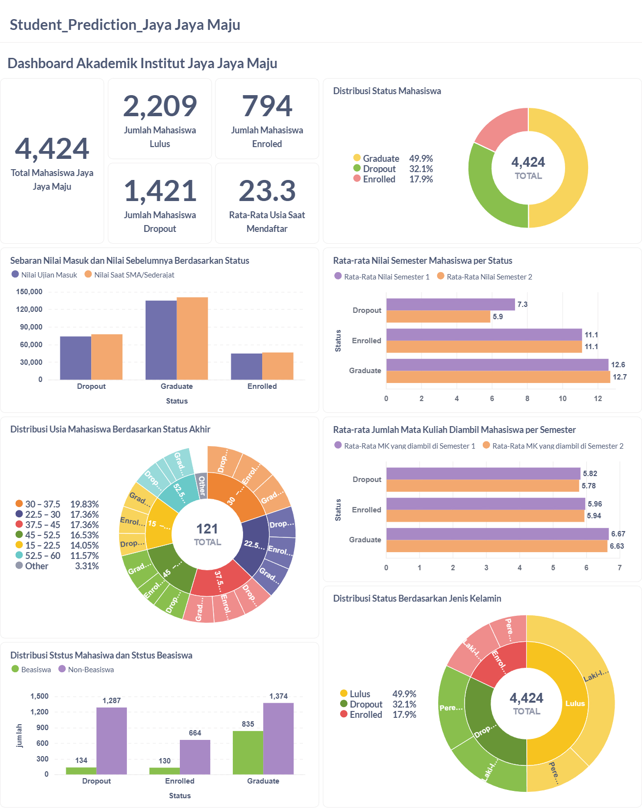
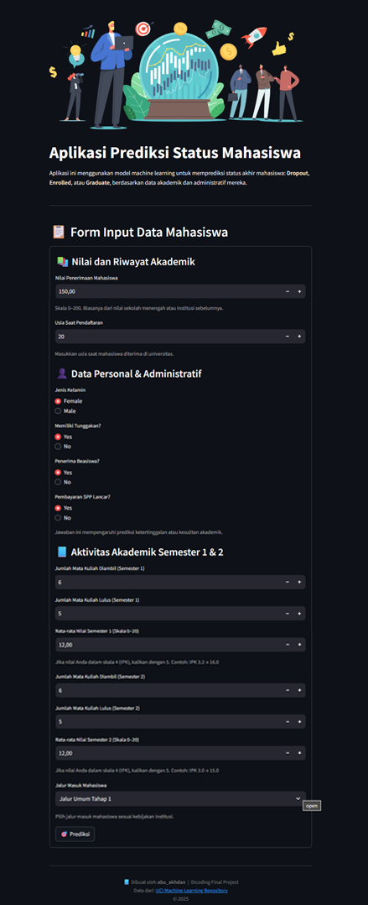

# **Proyek Akhir: 🎓 Prediksi Status Mahasiswa dan Visualisasi Dashboard Akademik**

## Business Understanding

**Latar Belakang**  
Institut Jaya Jaya Maju adalah institusi pendidikan tinggi yang ingin meningkatkan efisiensi akademik dengan menekan angka mahasiswa yang gagal menyelesaikan studi (dropout). Setiap tahun, dropout menjadi perhatian karena berdampak pada performa akreditasi, efektivitas program studi, dan alokasi sumber daya institusi.

Selama ini, intervensi terhadap mahasiswa berisiko baru dilakukan saat kondisi akademik mereka sudah kritis. Padahal, institusi memiliki data historis akademik dan administratif yang sebenarnya bisa dimanfaatkan untuk membangun sistem prediktif. Dengan pendekatan berbasis data, institusi dapat mengambil langkah preventif sebelum mahasiswa benar-benar terputus dari studi.

---

### **Tujuan Bisnis:**

Proyek ini bertujuan membangun solusi berbasis machine learning untuk memprediksi status akhir mahasiswa, serta menyajikan dashboard visual untuk mendukung pengambilan keputusan manajerial. Tujuan spesifik yang ingin dicapai antara lain:

- Membantu kampus mengidentifikasi mahasiswa berisiko dropout secara dini.
- Menyediakan aplikasi prediksi berbasis web (Streamlit) yang mudah digunakan.
- Menyediakan dashboard interaktif (Metabase) sebagai alat monitoring data akademik.
- Memberikan insight strategis dari data historis mahasiswa sebagai dasar kebijakan akademik.

--- 

### **Permasalahan Bisnis**

- Institusi pendidikan belum memiliki sistem prediktif yang dapat mengidentifikasi mahasiswa yang berpotensi tidak menyelesaikan studi tepat waktu (dropout).
- Intervensi terhadap mahasiswa bermasalah seringkali dilakukan terlambat karena tidak ada indikator risiko yang jelas dan terdokumentasi secara sistematis.
- Pihak manajemen kesulitan meninjau data akademik dalam format visual yang mudah dipahami.
- Dibutuhkan sistem yang dapat menyajikan informasi berbasis data untuk mendukung kebijakan akademik dan perencanaan intervensi yang efektif.


### **📦 Cakupan Proyek**

Proyek ini dikembangkan secara end-to-end dan mencakup:

1. **Data Understanding dan Eksplorasi (EDA)**
   - Menganalisis distribusi data dari 8.848 mahasiswa berdasarkan usia, nilai akademik, status keuangan, beasiswa, dan gender.
   - Visualisasi korelasi antar fitur numerik menggunakan metode Spearman.

2. **Data Preparation dan Feature Selection**
   - Menyeleksi 14 fitur utama dari data mentah berdasarkan korelasi dan relevansi.
   - Menangani nilai hilang, encoding kategorikal, dan scaling numerik.

3. **Penanganan Ketidakseimbangan Kelas**
   - Menerapkan teknik SMOTETomek untuk menyeimbangkan distribusi label `Status`.

4. **Modeling dan Evaluasi**
   - Membangun 4 model klasifikasi: Random Forest, Logistic Regression, SVM, dan XGBoost.
   - Evaluasi model menggunakan metrik: F1-score (macro), Precision, Recall, dan ROC-AUC.
   - Random Forest dipilih sebagai model terbaik dan disimpan sebagai `.pkl`.

5. **Aplikasi Prediksi (Streamlit)**
   - Membangun aplikasi berbasis web yang mampu menerima input user dan memberikan prediksi status akhir mahasiswa.
   - Dilengkapi dengan panduan input dan konversi nilai IPK ke skala 0–20.

6. **Dashboard Interaktif (Metabase)**
   - Menyediakan visualisasi performa akademik mahasiswa dalam bentuk KPI, grafik multivariat, pivot tabel, dan analisis status berdasarkan gender, usia, dan jalur masuk.
   - Membantu pengambil keputusan memantau tren dropout dan efektivitas kebijakan beasiswa.

---


## **🧰 Persiapan**

Tahapan awal proyek ini mencakup penyiapan data, instalasi library yang ada pada `requierement.txt`, hingga menjalankan model prediksi dan dashboard interaktif. 

Berikut merupakan langkah-langkah untuk menggunakan aplikasi/hasil analisis ini.

#### **1. Eksplorasi dan Pemahaman Data Mahasiswa**
**🔗 Sumber Data**

Dataset yang digunakan dalam proyek ini adalah:

Judul: Predict Students Dropout and Academic Success

Dataset ini berasal dari UCI Machine Learning Repository dan berisi informasi akademik, keuangan, serta demografik mahasiswa. Tujuan penggunaannya adalah untuk membangun model klasifikasi status mahasiswa: `Dropout`, `Enrolled`, atau `Graduate`. Dataset ini bersaral dari Portugal.
- Link dataset resmi: [sumber](https://archive.ics.uci.edu/ml/datasets/697)

Dataset ini memiliki 4424 entri dan 36 fitur, mencakup performa akademik, riwayat pendaftaran, status keuangan, dan data personal mahasiswa.


#### **2. Pembersihan dan Transformasi Data**

- Menghapus atau mengganti nilai kosong
- Melakukan encoding pada fitur kategorikal (label dan one-hot encoding)
- Normalisasi fitur numerik
- Penanganan ketidakseimbangan label menggunakan SMOTETomek
- Seleksi 14 fitur terbaik berdasarkan korelasi Spearman

#### **3. Pembuatan Aplikasi Prediksi Menggunakan Streamlit**

Model terbaik (Random Forest) disimpan ke dalam file `.pkl` dan di-deploy melalui aplikasi web menggunakan Streamlit. Aplikasi ini memungkinkan pengguna untuk memasukkan data secara manual dan memperoleh prediksi status mahasiswa secara langsung.

---

### **▶️ Cara Menjalankan Proyek**

#### **📦 A. Setup Environment**

Untuk menjalankan proyek ini secara lokal, silakan siapkan environment Python terlebih dahulu. Tersedia dua opsi instalasi:

**1)🔸 Menggunakan Anaconda**

```bash
conda create --name student-dropout-env python=3.9
conda activate student-dropout-env
pip install -r requirements.txt
```

**2) 🔹 Menggunakan Pipenv (Shell/Terminal)**

Buka terminal di anaconda dan ketikan
```bash
pip install pipenv
pipenv install
pipenv shell
pip install -r requirements.txt
```

Pastikan file `requirements.txt` berada pada direktori utama proyek sebelum menjalankan perintah di atas.


#### **📓 B. Menjalankan Notebook**
Gunakan Google Colab atau Jupyter Notebook untuk membuka file `notebook.ipynb`, lalu jalankan semua sel secara berurutan dari atas ke bawah untuk melakukan analisis data, modeling, dan evaluasi.

Catatan: Jika menggunakan collabs, pastikan dataset di unggah pada folder dan ganti instruksi load dataset disesuaikan dengan lokasi folder di drive. 

#### **📊 C. Menjalankan Dashboard (Metabase)**

Untuk melihat isi dashboard secara langsung, dapat menggunakan **metabase** dengan bantuan Docker (pastikan Docker sudah terinstall). 
Pastikan telah menginstal:
- [Docker Desktop](https://www.docker.com/products/docker-desktop/) di sistem operasi yang digunakan
- File `.db` Metabase (`metabase.db.mv.db`) untuk langsung mengakses model dashboard yang telah dibuat, jalankan perintah berikut:
  
```bash
docker pull metabase/metabase:v0.46.4
```

- Jalankan container Metabase menggunakan perintah:

```bash
docker run -p 3000:3000 --name metabase metabase/metabase
```

- Login ke Metabase menggunakan username dan password berikut:

```bash
username: root@mail.com
password: root1234
```

---


## 📊 Business Dashboard

Dashboard interaktif dibangun menggunakan **Metabase** sebagai alat bantu visual untuk membantu manajemen kampus dalam memahami faktor-faktor yang memengaruhi status akhir mahasiswa. Visualisasi ini memberikan gambaran menyeluruh mengenai profil akademik dan administratif mahasiswa berdasarkan data historis.

Hasil dari **Business Dashboard** adalah sebagai berikut:


---
#### **🎯 Tujuan Dashboard**

Tujuan utama dari dashboard ini adalah:

- Menyajikan **KPI penting** seperti jumlah mahasiswa dropout, enrolled, dan graduate.
- Menampilkan **distribusi mahasiswa** berdasarkan jenis kelamin, status beasiswa, usia, dan jalur masuk.
- Memberikan **insight multivariat** yang mengaitkan performa akademik dengan status akhir mahasiswa.
- Mempermudah pengambilan keputusan bagi pihak manajemen dan dosen tanpa perlu memahami detail teknis analisis.

#### **🧩 Komponen Visualisasi Dashboard**

Berikut adalah elemen-elemen utama dalam dashboard:

1. KPI Cards: Total mahasiswa, jumlah dropout, enrolled, dan graduate.
2. Pie Chart: Proporsi status mahasiswa secara keseluruhan.
3. Bar Chart:
   - Distribusi status berdasarkan jenis kelamin dan beasiswa.
   - Rata-rata nilai semester per status mahasiswa.
   - Jumlah mata kuliah yang diambil dan diselesaikan di tiap semester.
4. Pivot Table: Tabel silang antara status mahasiswa dan variabel seperti beasiswa dan gender.
5. Diagram Usia: Sebaran usia saat masuk dan korelasinya dengan status akhir.
6. Jalur Masuk (Application Mode): Visualisasi status akhir berdasarkan jenis jalur penerimaan mahasiswa.

#### **📌 Insight dari Dashboard**

Beberapa temuan yang dapat disimpulkan dari dashboard:

- **Mahasiswa tanpa beasiswa** memiliki rasio dropout yang jauh lebih tinggi dibandingkan penerima beasiswa.
- **Gender** menunjukkan tren di mana **mahasiswa laki-laki lebih dominan mengalami dropout**.
- Rata-rata **nilai semester dan jumlah mata kuliah yang lulus** sangat berpengaruh terhadap kelulusan.
- **Jalur masuk tertentu** menunjukkan pola risiko dropout yang lebih tinggi, misalnya dari kategori lintas institusi.

---

## 🧠 Menjalankan Sistem Machine Learning

Sistem machine learning ini telah diimplementasikan dalam bentuk aplikasi berbasis web menggunakan **Streamlit**, yang memungkinkan pengguna non-teknis untuk memasukkan data mahasiswa dan langsung memperoleh hasil prediksi status akhir: **Dropout**, **Enrolled**, atau **Graduate**.

Aplikasi ini memuat model **Random Forest** yang telah dilatih dan disimpan dalam file `final_rf_model.pkl`, serta scaler untuk preprocessing input user.

**1. Salin File Model**

Pastikan file berikut telah tersedia di direktori yang sama dengan `app.py`:
- `final_rf_model.pkl`
- `scaler.pkl`

Jika file berada di direktori `model/`, pastikan jalur di dalam kode disesuaikan jika terjadi Error file tidak ditemukan:

```python
model = joblib.load("model/final_rf_model.pkl")
scaler = joblib.load("model/scaler.pkl")
```

**2. Install Library streamlit** 

Lakukan installasi Library streamlit terlebih dahulu (jika belum) dengan perintah:

```python
pip install streamlit
```

**3. Jalankan Aplikasi**

Buka terminal, lalu jalankan perintah berikut:

```bash
streamlit run app.py
```

*catatan: jika terjadi error pastikan app.py ditambahkan dengan lokasi direktori, misal `C:/folder/app.py`*


Aplikasi akan terbuka secara otomatis di browser melalui `http://localhost:8501`.
Hasil dari **`app.py`** adalah sebagai berikut:


___
🌐 Link Aplikasi Online (Streamlit Cloud)
Aplikasi juga dapat diakses secara langsung melalui internet pada tautan berikut:

👉 : https://studentprediction-vkk6zfmfntsr8eaoel8ved.streamlit.app/

---

## ✅ Conclusion

Proyek ini berhasil membangun sebuah sistem prediksi status mahasiswa berbasis machine learning, serta dashboard interaktif yang membantu pemangku kepentingan kampus dalam memahami karakteristik dan risiko akademik mahasiswa.

Berdasarkan proses eksplorasi data, modeling, dan visualisasi yang dilakukan, dapat diambil beberapa kesimpulan penting:

1. **Fitur akademik seperti nilai penerimaan, rata-rata nilai semester, dan jumlah mata kuliah yang lulus sangat berkorelasi dengan kelulusan mahasiswa.**
   Mahasiswa dengan performa akademik rendah di awal semester cenderung memiliki risiko dropout yang tinggi.

2. **Faktor sosial seperti status beasiswa dan jenis kelamin juga berpengaruh.**
   Mahasiswa tanpa beasiswa dan laki-laki lebih banyak mengalami dropout dibandingkan yang lain.

3. **Random Forest menjadi model terbaik dalam memprediksi status mahasiswa,** dengan skor evaluasi yang stabil dan hasil prediksi yang konsisten terhadap distribusi data.

4. **Dashboard Metabase** yang dikembangkan menyajikan insight visual yang mudah dipahami oleh pihak non-teknis, seperti dosen dan staf manajemen. Visualisasi KPI, distribusi, dan tabel pivot membantu dalam pemantauan tren akademik mahasiswa secara real-time.

5. **Sistem aplikasi prediksi berbasis Streamlit** memungkinkan pengguna mengakses sistem secara langsung melalui browser tanpa harus menguasai pemrograman. Sistem ini siap digunakan untuk mendukung pengambilan keputusan berbasis data dalam lingkungan kampus.

---

### ✅ Rekomendasi Action Items

Berdasarkan hasil analisis data, modeling prediktif, serta visualisasi dashboard interaktif, berikut beberapa rekomendasi yang dapat diterapkan oleh pihak Institut Jaya Jaya Maju untuk meningkatkan angka kelulusan dan menurunkan dropout mahasiswa:

- **Perhatian khusus bagi mahasiswa tanpa beasiswa**. Data menunjukkan bahwa mahasiswa yang tidak menerima beasiswa memiliki tingkat dropout yang jauh lebih tinggi. Perlu strategi intervensi keuangan atau pendampingan bagi kelompok ini.

- **Deteksi dini untuk mahasiswa dengan nilai awal rendah**. Mahasiswa dengan nilai penerimaan dan nilai rata-rata semester 1 yang rendah terbukti memiliki korelasi kuat terhadap risiko dropout. Sistem pemantauan nilai sejak semester pertama sangat krusial.

- **Segmentasi risiko berdasarkan jalur masuk mahasiswa**. Beberapa jalur penerimaan (application mode) menunjukkan pola dropout yang konsisten. Evaluasi terhadap kesiapan akademik mahasiswa dari jalur tersebut perlu dilakukan.

- **Laki-laki lebih dominan mengalami dropout dibanding perempuan**. Gender menjadi indikator penting. Mahasiswa laki-laki perlu mendapat perhatian lebih dalam pembinaan akademik secara berkala.

- **Mahasiswa dengan usia masuk lebih tua cenderung gagal lulus**. Sebaran usia menunjukkan bahwa kelompok usia >30 tahun memiliki risiko dropout yang meningkat. Strategi pembelajaran dan fleksibilitas jadwal bisa dipertimbangkan untuk kelompok ini.

---
